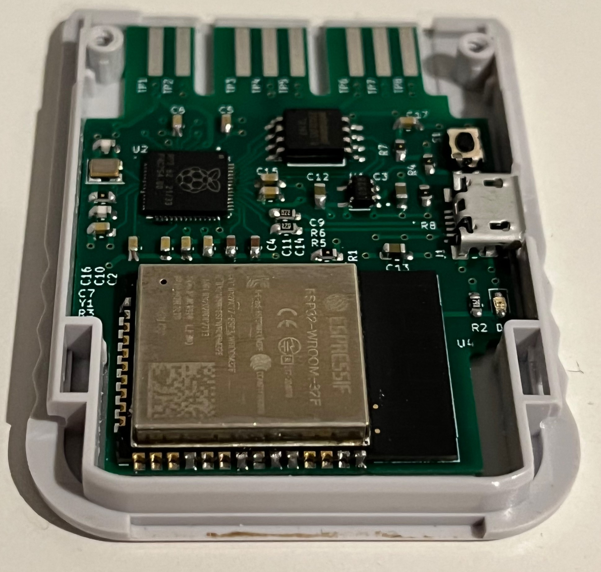
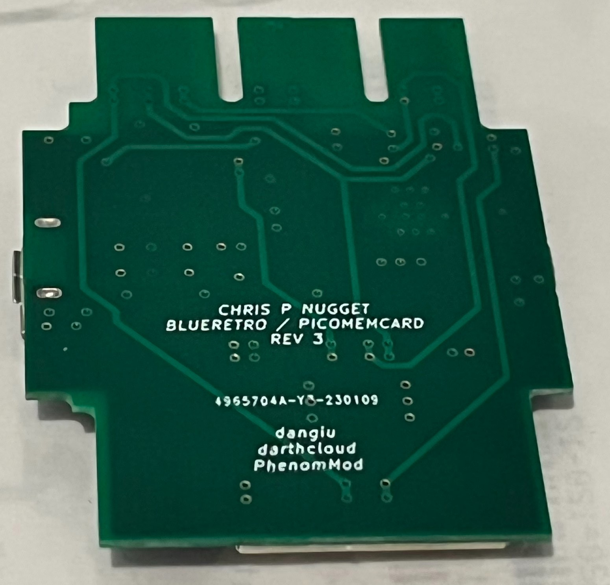

# BlueMemCard

BlueMemCard is a drop-in replacement PCB for the PSX memory card that combines the existing PicoMemcard and BlueRetro technologies into one board. BlueMemCard allows the use of a Bluetooth controller while also functioning as a regular memory card and also allows the memory card image to be transferred to a PC via USB. Just as important, the board fits right in the stock Sony memory card housing, resulting in a stock and stealth look. 

This is possible as the PSX memory card and controller ports share the same bus, and have nearly identical pinouts. Currently only P1 is supported, and there is no detection if a regular controller is connected. 

  

Demo Video: https://youtu.be/jc9e9mESD8Y 

**Note:** As of Feb 18 2023, rev3 boards have been assembled and tested successfully.

# Ordering Instructions

The Gerber files have been generated specific to JLCPCB: https://support.jlcpcb.com/article/149-how-to-generate-gerber-and-drill-files-in-kicad

Specify 0.8mm board thickness. 

Specify the following layer sequence:

L1 (Top Layer)     - ps1_memcard_test_rev6-F_Cu.gtl

L2 (Inner Layer 1) - ps1_memcard_test_rev6-In1_Cu.g2

L3 (Inner Layer 2) - ps1_memcard_test_rev6-In2_Cu.g3

L4 (Bottom Layer)  - ps1_memcard_test_rev6-B_Cu.gbl

# Assembly Instructions

See BOM folder for parts list and DigiKey / Mouser links.

When dropping in the assembled board into the memory card housing, you may need to use flush cutters to snip off a support under the top half of the housing. Only some memory cards seem to have this support. Also, for rev3 boards, some filing of the inner shell to fit the micro USB port is necessary. 

# Software Instructions

The ESP32 can be flashed via darthcloud's instructions: https://github.com/darthcloud/BlueRetro/wiki/BlueRetro-DIY-Build-Instructions

Here are instructions specific to Windows 10: https://github.com/darthcloud/BlueRetro/wiki/Flashing-firmware-Windows-10

To flash modules, a board like this can be used: https://a.co/d/7GO22nZ 

This project does not support PicoMemcard+, only the original PicoMemCard project. Use PicoMemcard.uf2 in v1.0.0 from the PicoMemcard releases: https://github.com/dangiu/PicoMemcard/releases

The memory card image you drop onto the board must be named MEMCARD.MCR

A sample memory card file can be found on the PicoMemCard Github: https://github.com/dangiu/PicoMemcard/tree/pmc%2B/release/docs/images/SampleMemoryCard 

# Credits and Notes

This project is merely a combination of two incredible projects by darthcloud and dangiu. I also matched my PCB dimensions to PhenomMod's sd2psx board.

https://github.com/darthcloud/BlueRetro

https://github.com/dangiu/PicoMemcard

https://github.com/sd2psx/pcb 

If you feel so inclined, please support these creators.

https://ko-fi.com/darthcloud

https://www.patreon.com/darthcloud

https://ko-fi.com/dangiu

https://store.phenommod.com/

